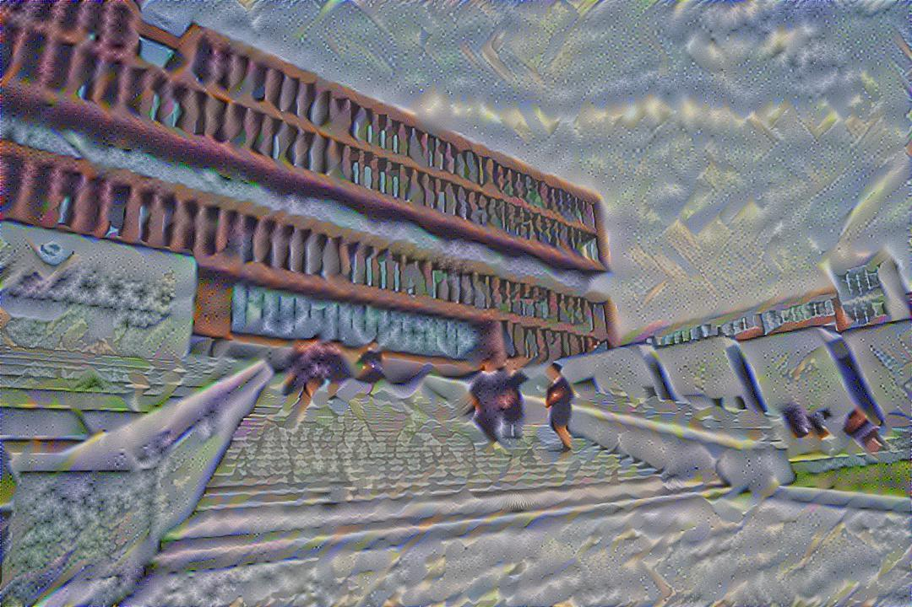
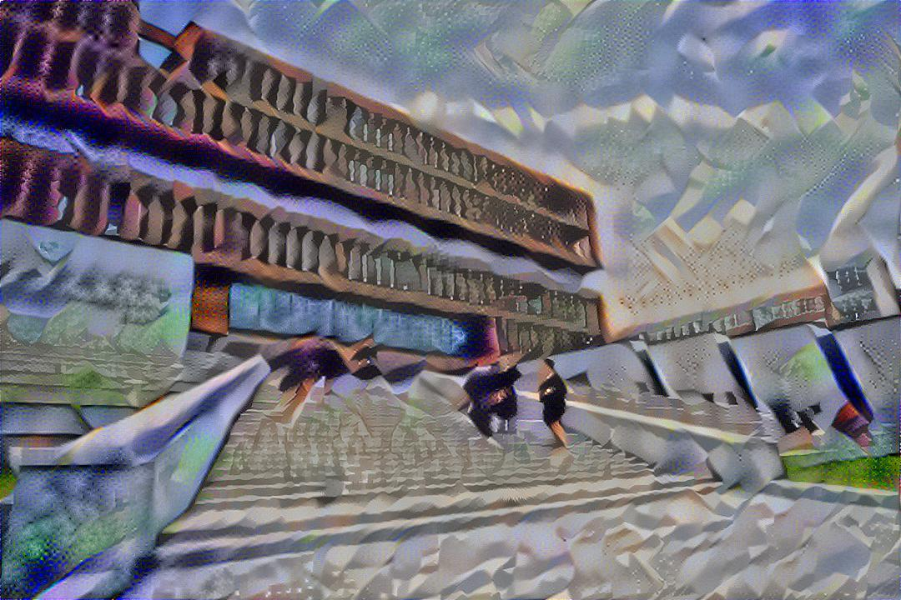
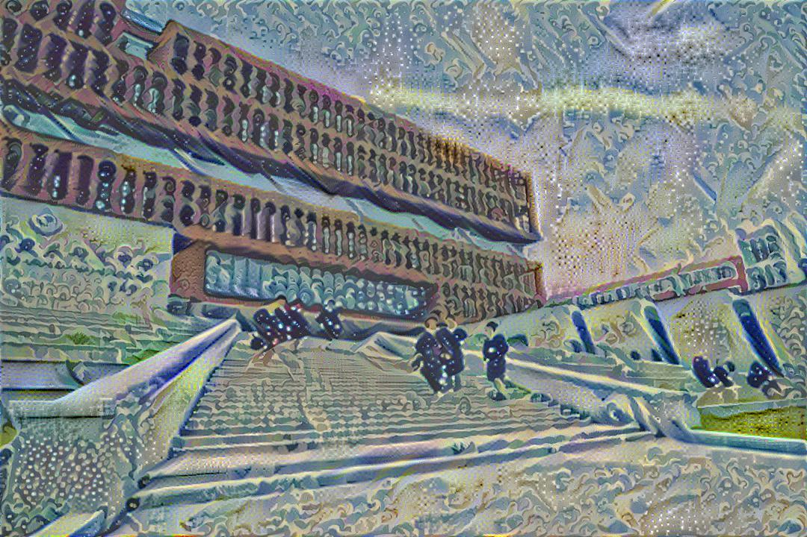

# 综合课程设计——人工智能的风格迁移

<center>
孟渝桓 18221785 2021.5.27
</center>

## 原理解释

#### 1. 深度学习

图像风格迁移属于深度学习的范畴。

风格迁移就是把一张图片的内容和另一个图片的风格合成的一个方法，例如给出一张教学楼的图片和一位艺术家（_Francis Picabia_）的作品《_Udnie_, Young American Girl》，就可以生成一副带有其风格的图像。

<center>
  
  
  
</center>
在深度学习之前，机器视觉的工程师就尝试使用各类滤镜提取图像的纹理信息，将抽取来的纹理图在经过某个变换放回到原图片里，就得到了一个新的风格的图片，而深度学习就是利用卷积网络的深层结构提取的信息，来替代之前的各种滤镜。卷积网络目前主要用于图像识别分类技术，其实在其中间层中包含了丰富的有用信息，而这些正是风格迁移的基础。

如果研究 CNN 的各层级结构，会发现里面的每一层神经元的激活态都对应了一种特定的信息，越是底层的就越接近画面的纹理信息，如同物品的材质； 越是上层的，就越接近实际内容，如同物品的种类。

那么，风格迁移就是把一张图片的底层信息和另一张图片的上层信息结合在一起的方法。用适当的数学方法，我们可以在卷积网络的中间层里提取图象内容有关的信息（_content_）和图象风格有关的信息（_style_）。


<center>
<font size=2>
（取自论文《A Neural Algorithm of Artistic Style》，Leon A. Gatys, Alexander S. Ecker, Matthias Bethge）
</font>
</center>

---

#### 2. VGG19

现在知道，我们可以通过一个已经训练好的 CNN 把一张风格图片和内容图片的信息都抽取出来， 然后拼在一起完成图像风格迁移。图像传递信息的底层机制是相通的，所以 一个用分类任务训练好的 CNN，通常已经具有了对大多数图像提取信息的能力。 此时， 图片一导进来， 网络就可以生成直接可用的特征。这里我们导入一个已经训练好的 VGG19 网络——一种非常流行的 CNN 图像分类框架。

VGG 是 _Oxford_ 的 _Visual Geometry Group_ 提出的。VGG 有两种结构，分别是 VGG16 和 VGG19，两者并没有本质上的区别，只是网络深度不一样。

VGG19 的网络结构如下：

```python
'''
    Details of the VGG19 model:
    - 0 is conv1_1 (3, 3, 3, 64)
    - 1 is relu
    - 2 is conv1_2 (3, 3, 64, 64)
    - 3 is relu
    - 4 is maxpool
    - 5 is conv2_1 (3, 3, 64, 128)
    - 6 is relu
    - 7 is conv2_2 (3, 3, 128, 128)
    - 8 is relu
    - 9 is maxpool
    - 10 is conv3_1 (3, 3, 128, 256)
    - 11 is relu
    - 12 is conv3_2 (3, 3, 256, 256)
    - 13 is relu
    - 14 is conv3_3 (3, 3, 256, 256)
    - 15 is relu
    - 16 is conv3_4 (3, 3, 256, 256)
    - 17 is relu
    - 18 is maxpool
    - 19 is conv4_1 (3, 3, 256, 512)
    - 20 is relu
    - 21 is conv4_2 (3, 3, 512, 512)
    - 22 is relu
    - 23 is conv4_3 (3, 3, 512, 512)
    - 24 is relu
    - 25 is conv4_4 (3, 3, 512, 512)
    - 26 is relu
    - 27 is maxpool
    - 28 is conv5_1 (3, 3, 512, 512)
    - 29 is relu
    - 30 is conv5_2 (3, 3, 512, 512)
    - 31 is relu
    - 32 is conv5_3 (3, 3, 512, 512)
    - 33 is relu
    - 34 is conv5_4 (3, 3, 512, 512)
    - 35 is relu
    - 36 is maxpool
    - 37 is fullyconnected (7, 7, 512, 4096)
    - 38 is relu
    - 39 is fullyconnected (1, 1, 4096, 4096)
    - 40 is relu
    - 41 is fullyconnected (1, 1, 4096, 1000)
    - 42 is softmax
'''
```


---

#### 3. 损失函数

##### 3.1 内容损失函数 `content_loss_func()`

深度卷积网络可以做到测量与内容有关的特征，我们只需要在这个层次上找一下特征向量的距离即可。图像可看作是高维空间的一个点，通过神经网络变换再经过特定降维方法处理后我们可以给它转化成二维曲面上的一个点，而我们只需要度量不同图像的空间距离，就测量了内容的相似度。

$\vec{p}$ 输入 VGG19 中，我们提取其在第四个 _block_ 中第二层的 _Feature Map_，表示为 _conv4_2_。假设其层数为 $l$，$N_l$ 是 _Feature Map_ 的数量，也就是通道数，$M_l$ 是 _Feature Map_ 的像素点的个数。那么我们得到 _Feature Map_ $F^l$ 可以表示为 $F^l \in \mathcal{R}^{N_l \times M_l}$，$F^l_{ij}$ 则是第层 $l$ 的第 $i$ 个 _Feature Map_ 在位置 $j$ 处的像素点的值。根据同样的定义，我们可以得到 $\vec{x}$ 在 _conv4_2_ 处的 _Feature Map_ $P^l$。

如果 $\vec{x}$ 的 $F_l$ 和 $\vec{p}$ 的 $P^l$ 非常接近，那么我们可以认为 $\vec{x}$ 和 $\vec{p}$ 在内容上比较接近，因为越接近输出的层包含有越多的内容信息。这里我们可以定义内容损失函数 `content_loss_func()` 为：

$$ \mathcal{L}_{\text{content}}(\vec{p},\vec{x},l)=\frac{1}{2}\sum_{i,j}(F*{i,j}^l -P*{i,j}^l)^2 $$

即代码中：

```python
# 定义内容损失函数
def content_loss_func(sess, model):
    def _content_loss(p, x):
        N = p.shape[3]
        M = p.shape[1] * p.shape[2]
        return (1 / (4 * N * M)) * tf.reduce_sum(tf.pow(x - p, 2))
    return _content_loss(sess.run(model['conv4_2']), model['conv4_2'])
```

---

##### 3.2 风格损失函数 `style_loss_func()`

在深度学习的角度下， 图像风格与不同神经元活动的相关性有关，也就是说，风格是深度网络神经元活动的某种统计特性。

不同于内容表示的直接运算，风格表示使用的是 _Feature Map_ 展开成一维向量的 _Gram_ 矩阵的形式。


使用 _Gram_ 矩阵的原因是因为考虑到纹理特征是和图像的具体位置没有关系的，所以通过打乱纹理的位置信息来保证这个特征。它通过测量同一层卷积输出不同通道之间的相关性（计算不同通道间的相关性，组成一个矩阵）给出一个对风格的度量。然后，我们再测量一下风格（_Gram_）之间的距离即可。 _Gram_ 定义如下：

$$G_{i,j}^l = \sum_k F_{i,k}^l F_{j,k}^l$$

定义一个 $E_l$ 矩阵，$E_l$ 是 $S^l$ 的 _Gram_ 矩阵 $A^l$ 和 $F^l$ 的 _Gram_ 矩阵 $G^l$ 的均方误差：

$$E_l = \frac{1}{4N_l^2M_l^2}\sum_{i,j}(G_{i,j}^l - A_{i,j}^l)^2$$

另外一点和内容表示不同的是，风格表示使用了每个 _block_ 的第一个卷积来计算损失函数，这种方式得到的纹理特征更为光滑。因为仅仅使用底层 _Feature Map_ 得到的图像较为精细但是比较粗糙，而高层得到的图像则含有更多的内容信息，损失了一些纹理信息，但他的材质更为光滑。所以，综合了所有层的样式表示的损失函数为：

$$L_{style} = \sum_l w_l E_l$$

这个损失函数就是 _Gram_ 矩阵之间的距离。

即代码中：

```python
STYLE_LAYERS = [('conv1_1', 0.5), ('conv2_1', 1.0),
                ('conv3_1', 1.5), ('conv4_1', 3.0), ('conv5_1', 4.0)]


def style_loss_func(sess, model):
    def _gram_matrix(F, N, M):
        Ft = tf.reshape(F, (M, N))
        return tf.matmul(tf.transpose(Ft), Ft)

    def _style_loss(a, x):
        N = a.shape[3]
        M = a.shape[1] * a.shape[2]
        A = _gram_matrix(a, N, M)
        G = _gram_matrix(x, N, M)
        return (1 / (4 * N ** 2 * M ** 2)) * tf.reduce_sum(tf.pow(G - A, 2))

    return sum([_style_loss(sess.run(model[layer_name]), model[layer_name]) * w for layer_name, w in STYLE_LAYERS])
```

---

##### 3.3 损失函数

清楚了如何计算内容损失函数 $\mathcal{L}_{content}$ 和风格损失函数 $\mathcal{L}_{style}$ 之后，整个风格迁移任务的损失函数就是两个损失值得加权和：

$$\mathcal{L}_{\text{total}}(\vec{p},\vec{a},\vec{x}) = \alpha \mathcal{L}_{\text{content}}(\vec{p}, \vec{x}) + \beta \mathcal{L}_{\text{style}}(\vec{a}, \vec{x})$$

通过调整 $\alpha$ 和 $\beta$ 这两个超参数的值我们可以设置生成的图像更偏向于 $\vec{p}$ 的内容还是 $\vec{a}$ 的风格。

即代码中：

```python
BETA = 5
ALPHA = 100

total_loss = BETA * content_loss + ALPHA * style_loss
```

---

##### 3.4 梯度下降

得到损失函数后，可以进行梯度下降（_SGD_）优化图像。但注意，这里优化的目标不是网络权重而是图像本身。

$$\frac{\partial \mathcal{L}_{content}}{\partial F_{i,j}^l} =  {\begin{cases}(F^l - P^l)_{i,j} & F_{i,j} > 0\\ 0 & F_{i,j} < 0 \end{cases}}$$

$$\frac{\partial E_l}{\partial F_{i,j}^l} =  {\begin{cases}{}  \frac{1}{N_l^2M_l^2}((F^l)^T(G^l-A^l))_{ji} & F_{i,j}^l > 0 \\  0 & F_{i,j}^l < 0  \end{cases}}$$

---

##### 3.5 $\vec{x}$ 的白噪声初始化

对于 $\vec{x}$ 的初始化，论文中推荐使用白噪音进行初始化，这样虽然计算的时间要更长一些，但是得到的图像的样式具有更强的随机性。而论文使用的是使用 $\vec{p}$ 初始化 $\vec{x}$ ，这样得到的生成图像更加稳定。

即代码中：

```python
NOISE_RATIO = 0.7

def generate_noise_image(content_image, noise_ratio=NOISE_RATIO):
    noise_image = np.random.uniform(-20, 20, (1,
                                              IMAGE_H, IMAGE_W, COLOR_C)).astype('float32')
    input_image = noise_image * noise_ratio + content_image * (1 - noise_ratio)
    return input_image
```

---

#### 4. 总结

图像风格迁移的整个过程可表示为下图：


以上是原始的图像风格迁移的基本原理。

事实上，原始的图像风格迁移速度非常慢，在 CPU 上生成一张图片需要数十分钟甚至几个小时，即使在 GPU 上也需要数分钟才能生成一张较大的图片，这大大的限制了这项技术的使用场景。

速度慢的原因在于，要使用总损失 $\mathcal{L}_{\text{total}}(\vec{p},\vec{a},\vec{x})$ 优化图片 $\vec{x}$ ，这意味着生成一张图片需要几百步梯度下降法的迭代，而每一步的迭代都需要耗费大量的时间。从另一个角度看，优化 $\vec{x}$ 可以看作是一个“训练模型”的过程，以往都是针对模型参数训练，而这里训练的目标是图片 $\vec{x}$ ，而训练模型一般都比执行训练好的模型要慢很多。

更迅速的方法是采用 _快速图像风格迁移_ ：不使用优化的方法来逐步迭代生成 $\vec{x}$ ，而是使用一个神经网络直接生成 $\vec{x}$ ，其模型结构如下，包括转换网络和损失网络。


有以下的优点和局限：

- 风格图片是固定的，以上模型只能用于将图片快速转换为指定风格的图片。
- 转换网络：参数需要提前训练，但如果有多个风格图片，对每个风格分别训练一个模型即可。。
- 经过训练后，转换网络所生成的迁移图片，在内容和输入的内容图片相似，在风格上和指定的风格图片相似
- 进行推断时，仅使用转换网络，输入内容图片，即可得到对应的迁移图片。

## 实验记录

#### 1. TensorFlow 环境搭建

TensorFlow 是一个基于数据流编程（dataflow programming）的符号数学系统，被广泛应用于各类机器学习（machine learning）算法的编程实现，TensorFlow 拥有多层级结构，可部署于各类服务器、PC 终端和网页并支持 GPU 和 TPU 高性能数值计算。

TensorFlow 提供 Python 语言下的四个不同版本：CPU 版本（TensorFlow ）、包含 GPU 加速的版本（TensorFlow -gpu ），以及它们的每日编译版本（tf-nightly 、tf-nightly-gpu ）。其中 macOS 版不包含 GPU 加速，这里使用了 Anaconda 安装了 TensorFlow 2.0 供实验使用。

##### 1.1 安装 Anaconda

采用官网（ https://www.anaconda.com/products/individual ）下载安装包的方式安装 Anaconda ，比较方便。

安装完毕后软件界面如图所示：


---

##### 1.2 建立 TensorFlow 运行环境

- 设置国内镜像

  因为需要安装许多第三方库，会发现 conda 下载速度很慢,因为 Anaconda .org 服务器在国外。这里提前设置了清华了 TUNA 镜像源，将其加入 conda 的配置即可，采用终端命令直接添加：

  ```bash
  conda config --add channels   https://mirrors.tuna.tsinghua.edu.cn/anaconda/pkgs/free/
  conda config --add channels https://mirrors.tuna.tsinghua.edu.cn/anaconda/pkgs/main/
  conda config --set show_channel_urls yes
  ```

- 安装 TensorFlow

  打开终端，创建一个包含 TensorFlow 的新 conda 环境并激活它：

  ```bash
  $ conda create -n tensorflow
  $ source activate tensorflow
  $ conda install tensorflow
  ```

  创建激活成功后能在 Anaconda 中查看：

  

---

##### 1.3 Spyder 下配置 TensorFlow

Spyder 是 Anaconda 自带的集成开发环境（IDE），可以在 Spyder 中进行 TensorFlow 的开发。

- 激活 TensorFlow 环境，确定当前的工作环境为 TensorFlow 安装所在的环境，安装 Spyder。

  

- 打开 Spyder，在 IPython Consloe 中输入：

  ```python
  import tensorflow as tf
  ```

  配置完成。

---

#### 2. 传统图像风格迁移（IST）实验

##### 2.1 准备

- 安装依赖

  ```bash
  pip install numpy scipy tensorflow keras
  ```

- 准备好需要转换的图片以及风格图片

  <center>
    
    
  </center>

  <center>
    
    
  </center>

  这里以杭电新建成的四教`（content4.jpg）`为例，采用 _梵高_ _星夜_ `（starry.jpg)` 为风格。

---

##### 2.2 代码实现

- 加载库、需要的模块以及预定义文件的路径。

  ```python
  import tensorflow as tf
  import numpy as np
  import scipy.io
  import scipy.misc
  import os
  import time

  CONTENT_IMG = 'content4.jpg'
  STYLE_IMG = 'starry.jpg'
  OUTPUT_DIR = 'IST_outputs/'

  if not os.path.exists(OUTPUT_DIR):
      os.mkdir(OUTPUT_DIR)
  ```

- 设置输出图像的大小、颜色通道，设置噪声比、VGG 模型和 VGG 预训练已知的平均值。

  ```python
  IMAGE_W = 1080
  IMAGE_H = 720
  COLOR_C = 3

  NOISE_RATIO = 0.7
  BETA = 5
  ALPHA = 100
  VGG_MODEL = 'imagenet-vgg-verydeep-19.mat'
  MEAN_VALUES = np.array([123.68, 116.779, 103.939]).reshape((1, 1, 1, 3))
  ```

- 加载 VGG 模型。注意，此处论文提出平均池化好于最大池化，在资源有限的情况下不必全部层的实验，有条件可以加多层数。

  ```python
  def load_vgg_model(path):
      vgg = scipy.io.loadmat(path)
      vgg_layers = vgg['layers']

      def _weights(layer, expected_layer_name):
          W = vgg_layers[0][layer][0][0][2][0][0]
          b = vgg_layers[0][layer][0][0][2][0][1]
          layer_name = vgg_layers[0][layer][0][0][0][0]
          assert layer_name == expected_layer_name
          return W, b

      def _conv2d_relu(prev_layer, layer, layer_name):
          W, b = _weights(layer, layer_name)
          W = tf.constant(W)
          b = tf.constant(np.reshape(b, (b.size)))
          return tf.nn.relu(tf.nn.conv2d(prev_layer, filter=W, strides=[1, 1, 1, 1], padding='SAME') + b)

      def _avgpool(prev_layer):
          return tf.nn.avg_pool(prev_layer, ksize=[1, 2, 2, 1], strides=[1, 2, 2, 1], padding='SAME')

      graph = {}
      graph['input'] = tf.Variable(
          np.zeros((1, IMAGE_H, IMAGE_W, COLOR_C)), dtype='float32')
      graph['conv1_1'] = _conv2d_relu(graph['input'], 0, 'conv1_1')
      graph['conv1_2'] = _conv2d_relu(graph['conv1_1'], 2, 'conv1_2')
      graph['avgpool1'] = _avgpool(graph['conv1_2'])
      graph['conv2_1'] = _conv2d_relu(graph['avgpool1'], 5, 'conv2_1')
      graph['conv2_2'] = _conv2d_relu(graph['conv2_1'], 7, 'conv2_2')
      graph['avgpool2'] = _avgpool(graph['conv2_2'])
      graph['conv3_1'] = _conv2d_relu(graph['avgpool2'], 10, 'conv3_1')
      graph['conv3_2'] = _conv2d_relu(graph['conv3_1'], 12, 'conv3_2')
      graph['conv3_3'] = _conv2d_relu(graph['conv3_2'], 14, 'conv3_3')
      graph['conv3_4'] = _conv2d_relu(graph['conv3_3'], 16, 'conv3_4')
      graph['avgpool3'] = _avgpool(graph['conv3_4'])
      graph['conv4_1'] = _conv2d_relu(graph['avgpool3'], 19, 'conv4_1')
      graph['conv4_2'] = _conv2d_relu(graph['conv4_1'], 21, 'conv4_2')
      graph['conv4_3'] = _conv2d_relu(graph['conv4_2'], 23, 'conv4_3')
      graph['conv4_4'] = _conv2d_relu(graph['conv4_3'], 25, 'conv4_4')
      graph['avgpool4'] = _avgpool(graph['conv4_4'])
      graph['conv5_1'] = _conv2d_relu(graph['avgpool4'], 28, 'conv5_1')
      graph['conv5_2'] = _conv2d_relu(graph['conv5_1'], 30, 'conv5_2')
      graph['conv5_3'] = _conv2d_relu(graph['conv5_2'], 32, 'conv5_3')
      graph['conv5_4'] = _conv2d_relu(graph['conv5_3'], 34, 'conv5_4')
      graph['avgpool5'] = _avgpool(graph['conv5_4'])
      return graph
  ```

- 定义内容损失函数。

  ```python
  def content_loss_func(sess, model):
      def _content_loss(p, x):
          N = p.shape[3]
          M = p.shape[1] * p.shape[2]
          return (1 / (4 * N * M)) * tf.reduce_sum(tf.pow(x - p, 2))
      return _content_loss(sess.run(model['conv4_2']), model['conv4_2'])
  ```

- 重新使用要定义的层，要平滑的特征可以增加高层权重，减少低层的权重，如要提取尖锐的特征，反之即可。

  ```python
  STYLE_LAYERS = [('conv1_1', 0.5), ('conv2_1', 1.0),
                  ('conv3_1', 1.5), ('conv4_1', 3.0), ('conv5_1', 4.0)]
  ```

- 定义风格损失函数。

  ```python
  def style_loss_func(sess, model):
      def _gram_matrix(F, N, M):
          Ft = tf.reshape(F, (M, N))
          return tf.matmul(tf.transpose(Ft), Ft)

      def _style_loss(a, x):
          N = a.shape[3]
          M = a.shape[1] * a.shape[2]
          A = _gram_matrix(a, N, M)
          G = _gram_matrix(x, N, M)
          return (1 / (4 * N ** 2 * M ** 2)) * tf.reduce_sum(tf.pow(G - A, 2))

      return sum([_style_loss(sess.run(model[layer_name]), model[layer_name]) * w for layer_name, w in STYLE_LAYERS])
  ```

- 定义初始化白噪声图像生成方法、加载和保存图像的方法。

  ```python
  # 产生一张初始图像
  def generate_noise_image(content_image, noise_ratio=NOISE_RATIO):
      noise_image = np.random.uniform(-20, 20, (1,
                                                IMAGE_H, IMAGE_W, COLOR_C)).astype('float32')
      input_image = noise_image * noise_ratio + content_image * (1 - noise_ratio)
      return input_image

  # 加载图像
  def load_image(path):
      image = scipy.misc.imread(path)
      image = scipy.misc.imresize(image, (IMAGE_H, IMAGE_W))
      image = np.reshape(image, ((1, ) + image.shape))
      image = image - MEAN_VALUES
      return image

  # 保存图像
  def save_image(path, image):
      image = image + MEAN_VALUES
      image = image[0]
      image = np.clip(image, 0, 255).astype('uint8')
      scipy.misc.imsave(path, image)
  ```

- 调用以上函数并训练模型。

  ```python
  the_current_time()
  
  with tf.Session() as sess:
      content_image = load_image(CONTENT_IMG)
      style_image = load_image(STYLE_IMG)
      model = load_vgg_model(VGG_MODEL)
  
      input_image = generate_noise_image(content_image)
      sess.run(tf.global_variables_initializer())
  
      sess.run(model['input'].assign(content_image))
      content_loss = content_loss_func(sess, model)
  
      sess.run(model['input'].assign(style_image))
      style_loss = style_loss_func(sess, model)
  
      total_loss = BETA * content_loss + ALPHA * style_loss
      optimizer = tf.train.AdamOptimizer(2.0)
      train = optimizer.minimize(total_loss)
  
      sess.run(tf.global_variables_initializer())
      sess.run(model['input'].assign(input_image))
  
      ITERATIONS = 1000
      for i in range(ITERATIONS):
          sess.run(train)
          if i % 50 == 0:
              output_image = sess.run(model['input'])
              the_current_time()
              print('Iteration %d' % i)
              print('Cost: ', sess.run(total_loss))
  
              save_image(os.path.join(
                  OUTPUT_DIR, 'ITERATIONS_%d.jpg' % i), output_image)
  ```

  

  

##### 2.3 实验结果

由于没有 GPU 加速，且进行了全部层的实验，所以代码运行的速度非常慢。

这并不是第一次实验，在前一次实验中采用了 800\*600px 的图像进行了测试，原始图像以及风格图像如下。

  <center>
    
    
  </center>

迭代次数设计为了 2000 次，每 50 次输出一张图片，输出如下。

这里分别选取了第 1、100、200 至 2000 次的输出如下。

  <center>
    
    
    
    
  </center>

  <center>
    
    
    
    
  </center>

  <center>
    
    
    
    
  </center>

  <center>
    
    
    
    
  </center>

  <center>
    
    
    
    
  </center>

该图像迭代 2000 次总计耗时约为 5 小时 25 分钟。


从输出中可以看出，在 1000 次以后图像已趋于稳定，风格进步并不明显，第 1000 次、1500 次、2000 次输出如下，并没有明显差别。

  <center>
    
    
    
  </center>

所以为了节约时间，在本次实验中将迭代次数减少到了一千次，输出如下。

  <center>
    
    
    
    
  </center>

  <center>
    
    
    
    
  </center>

  <center>
    
    
    
    
  </center>

  <center>
    
    
    
    
  </center>

  <center>
    
    
    
    
  </center>

可以发现，原来四教的照片现在已有 _星夜_ 的风格。

  <center>
    
    
  </center>

另外，虽然减少了迭代次数，但是图像的大小较上次实验有所增大，所以消耗的时间没有明显减少，约为 5 小时。


---

用其他另外两张风格的图像实现迁移效果如下。

- _《Udnie, Young American Girl》_

  <center>
    
    
  </center>

  <center>
    
    
    
    
  </center>

  <center>
    
    
    
    
  </center>

  <center>
    
    
    
    
  </center>

  <center>
    
    
    
    
  </center>

  <center>
    
    
    
    
  </center>

- _《神奈川冲浪里》_

  <center>
    
    
  </center>

  <center>
    
    
    
    
  </center>

  <center>
    
    
    
    
  </center>

  <center>
    
    
    
    
  </center>

  <center>
    
    
    
    
  </center>

  <center>
    
    
    
    
  </center>

即在此图片上共进行了三种不同风格的迁移，都取得了不错的效果。

  <center>
    
    
    
  </center>

---

#### 3. 快速图像风格迁移

##### 3.1 准备

- 已经训练好的风格模型 _samples_mosaic_ （一个模型约有 250m，由于 Fanya 平台上传文件大小的限制，作业中只包括了一种风格的模型）。

- 需转换的图片 _content4.jpg_。

  <center>
    
    
  </center>

---

##### 3.2 代码实现

```python
# -*- coding: utf-8 -*-
"""
Created on Thu May 27 2021

@author: 孟渝桓 18221785
"""

# 加载库、需要的模块以及预定义文件的路径。
import tensorflow as tf
import numpy as np
from imageio import imread, imsave
import os
import time

def the_current_time():
    print(time.strftime("%Y-%m-%d %H:%M:%S", time.localtime(int(time.time()))))

style = 'mosaic'
model = 'samples_%s' % style
content_image = 'content4.jpg'
result_image = 'content4_%s.jpg' % style
X_image = imread(content_image)

sess = tf.Session()
sess.run(tf.global_variables_initializer())

saver = tf.train.import_meta_graph(
    os.path.join(model, 'fast_style_transfer.meta'))
saver.restore(sess, tf.train.latest_checkpoint(model))

graph = tf.get_default_graph()
X = graph.get_tensor_by_name('X:0')
g = graph.get_tensor_by_name('transformer/g:0')

the_current_time()

gen_img = sess.run(g, feed_dict={X: [X_image]})[0]
gen_img = np.clip(gen_img, 0, 255) / 255.
imsave(result_image, gen_img)

the_current_time()
```

---

##### 3.3 实验结果

  <center>
    
    
  </center>

  <center>
    
    
  </center>

  <center>
    
    
  </center>

成功完成了图像风格迁移，但是转换后图片的质量取决于所用预训练模型的质量。

并且，快速图像风格迁移的 6-8 秒的运行消耗时间较传统图像风格迁移的 5 小时左右而言大大减少。


实验结束。

#### 4. git

项目 gitee 链接：https://gitee.com/cxris/image-style-transfer
